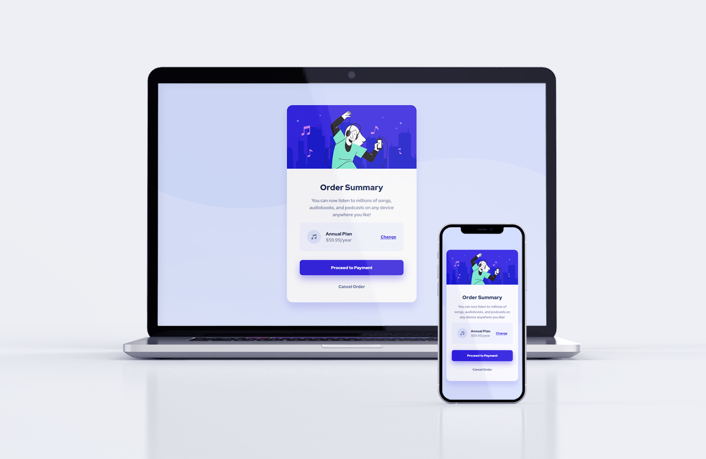

# Frontend Mentor - Order Summary Card Component

This is a solution to the [Order summary card challenge on Frontend Mentor](https://www.frontendmentor.io/challenges/order-summary-component-QlPmajDUj). Frontend Mentor challenges help you improve your coding skills by building realistic projects. 

## Table of contents

- [Overview](#overview)
  - [The challenge](#the-challenge)
  - [Screenshot](#screenshot)
  - [Links](#links)
- [My process](#my-process)
  - [What I built with](#what-i-built-with)
  - [What I learned](#what-i-learned)
  - [Continued development](#continued-development)
  - [Useful resources](#useful-resources)
- [Author](#author)


## Overview

### The challenge

The challenge is to build out the order summary card component and get it looking as close to the design as possible. Create both the desktop and mobile layouts. Users should be able to see hover states for interactive elements.

### Screenshot




### Links

- Solution URL: [Add solution URL here](https://your-solution-url.com)
- Live Site URL: [Add live site URL here](https://your-live-site-url.com)

## My process

### What I built with

- Semantic HTML5 markup
- CSS custom properties
- CSS logical properties
- Flexbox
- Minimal reliance on media queries


### What I learned

I used the semantic HTML <button> element for the first time:
```html
<button>
  <h3 class="btn">Proceed to Payment</h3>
  </button>
```
I created CSS custom properties at the top of my file for the first time, giving me easy access to all my colours:
```css
:root {
    --very-pale-blue: hsl(225, 100%, 98%);
    --pale-blue: hsl(225, 100%, 94%);
    --desaturated-blue: hsl(224, 23%, 55%);
    --bright-blue: hsl(245, 75%, 52%);
    --dark-blue: hsl(223, 47%, 23%);
}
```
I've begun using min() to set widths, to minimize reliance on media queries and create more responsive layouts:
```css
.card {
    width: min(460px, 90%);
}
```


### Continued development

Some areas I'd like to continue to develop are:

1. Better use of semantic HTML elements, not relying on divs for all sectioning 
2. Continuing to minimize reliance on media queries, experiment with mobile-first development 
3. Ensuring to check browser compatibility before using newer CSS properties
4. Lower specificity of CSS, more reusable components

### Useful resources

- [Conquering Responsive Layouts course by Kevin Powell](https://courses.kevinpowell.co/conquering-responsive-layouts) - This course has helped me really understand how to create elegant responsive layouts with minimal fuss. I'd highly recommend this free course to anyone who may be struggling or just wants to refine their knowledge of creating responsive layouts. His [YouTube channel](https://www.youtube.com/kepowob) is also a great resource with loads of amazing CSS content.


## Author

- Website - [emmaclarm.github.io](https://emmaclarem.github.io/)
- Frontend Mentor - [@emmaclarem](https://www.frontendmentor.io/profile/emmaclarem)
- LinkedIn - [Emma Miller](https://www.linkedin.com/in/emma-c-miller/)

